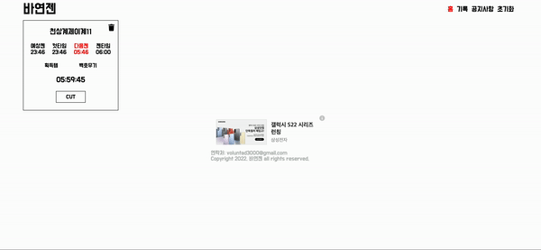
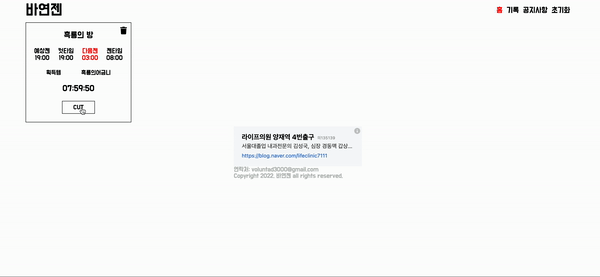
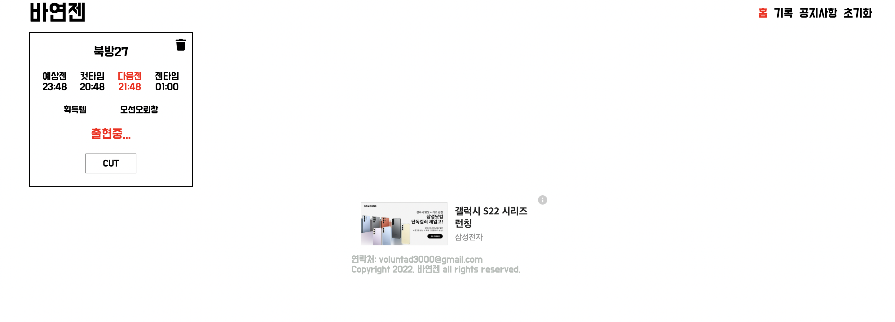
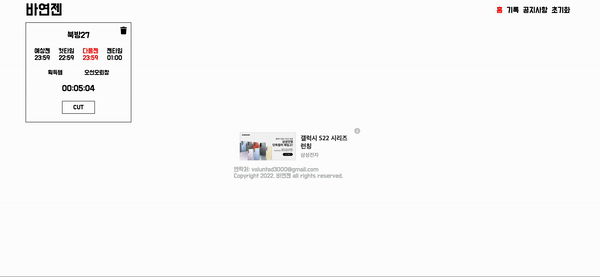
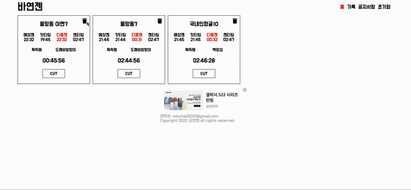
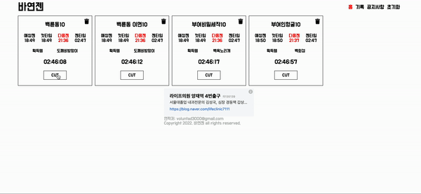
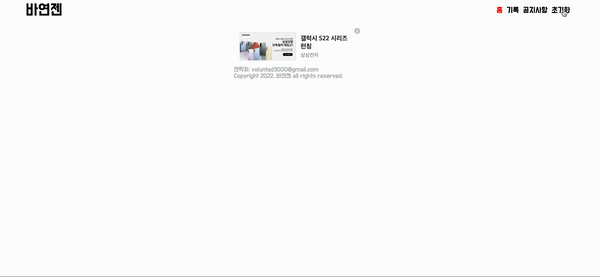

# 프로젝트 소개

 

## ✨ Project

- 바람의나라 연 보스 타이머입니다

 

## ✨ Link

[바연젠](https://bayeongen.shop)(:target="_blank")

 

## ✨ 주요기능

  
 타이머 

      

---

  
 실시간 컷 

      

---

  
 젠시간이 지났을때 

      

---

  
 보스젠 5분전 

      

---

  
 기록 삭제 

      

---

  
 컷버튼 클릭 시 시간 빠른 순 자동 정렬 

      

---

  
 초기화 

      

---

<!-- 

  
 타이머 

    

 -->

  

## ✨ Feature

- 보스를 잡고 다음 젠 시간이 얼마나 남았는지 확인할 수 있습니다
- 종료후 다시 시작해도 기록이 남아있습니다
- 기록을 한 뒤 홈에서 다음 젠 시간이 제일 빠른순으로 볼 수 있습니다
- 최근에 잡은 시간 또는 최근 점검 시간 기준으로 예상 젠 시간을 계산해 줍니다
- 반응형 웹을 구현하여 모바일과 PC에서 편리하게 이용할 수 있습니다

 

## ✨ Languages and Tools

### General

 

### Front-end

   
